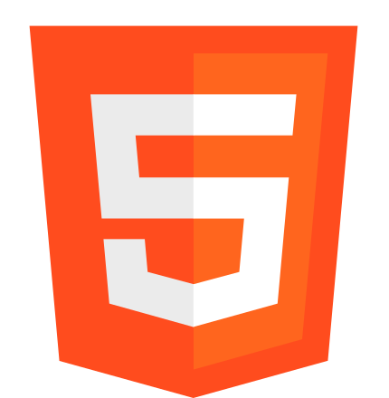
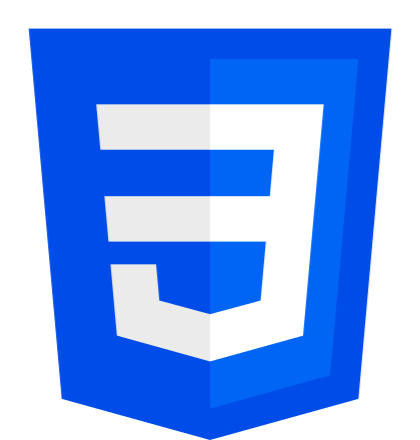
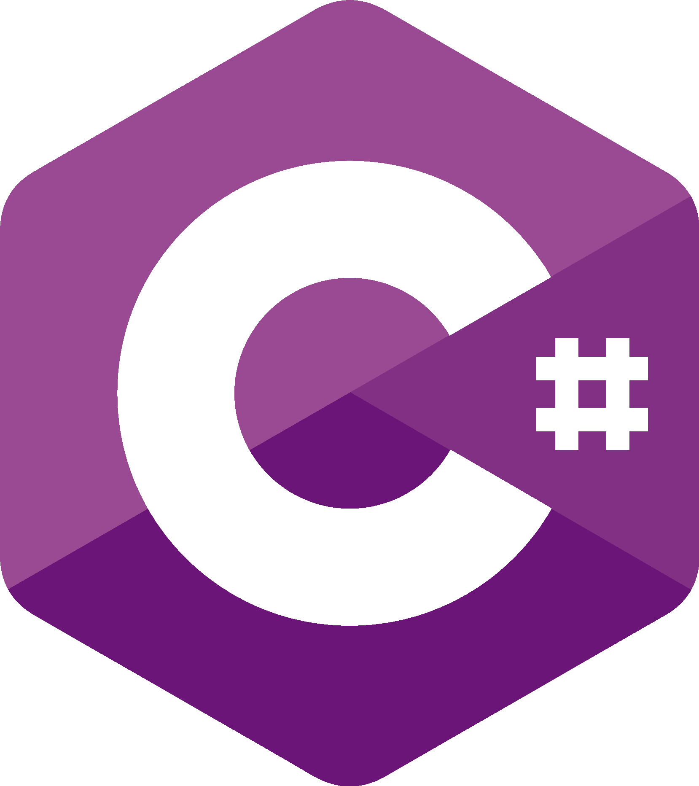
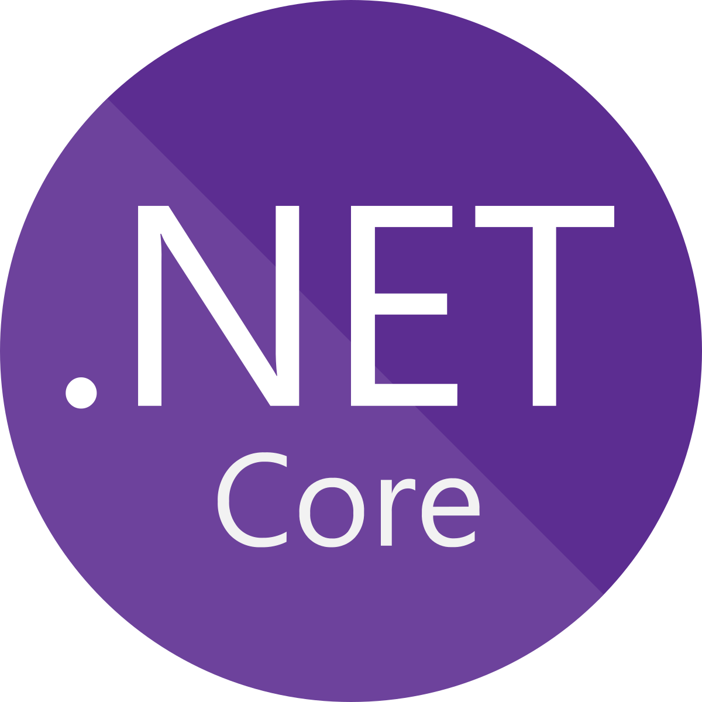

## Eu sou Miguel Passos, Desenvolvedor Junior | Front-End
Sou estudante de Desenvolvimento de Sistemas e estou sempre buscando evoluir, aprender novas técnicas e trabalhar em projetos que me desafiam.
Meu objetivo é me tornar um desenvolvedor completo e preparado para o mercado.
## Tecnologias que Utilizo e Estudo 

  

    
<strong>Front-End:</strong>

    
    
    
    
    
  

  

    
<strong>Back-end:</strong>

    
    
    

      
      
Basico

    

  

  

    
<strong>Outros:</strong>

    
    
    

      
      
Basico

    

  

## 📚 Atualmente estudando
- JavaScript avançado
- Boas práticas de Front-End
- Angular
- JQuery
- Interação com API

## Sobre Mim
- Tenho 17 anos e estudo Desenvolvimento de Sistemas  
- Sou apaixonado por tecnologia e programação no geral  
- Gosto de aprender diferentes áreas da programação para descobrir onde posso me especializar  
- Busco evoluir todos os dias como desenvolvedor, criando projetos e estudando novas tecnologias

## Contato
- Email: gibertoni.passos@gmail.com
- Numero: 13997745750
